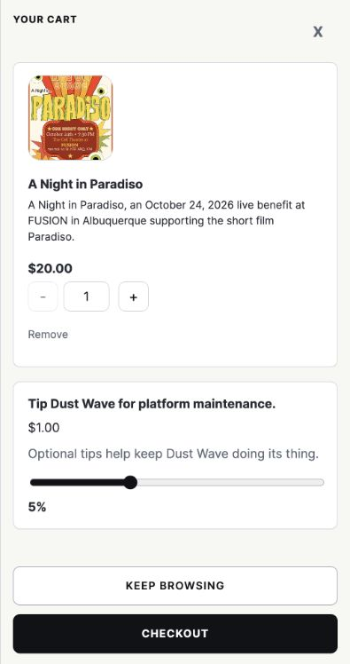
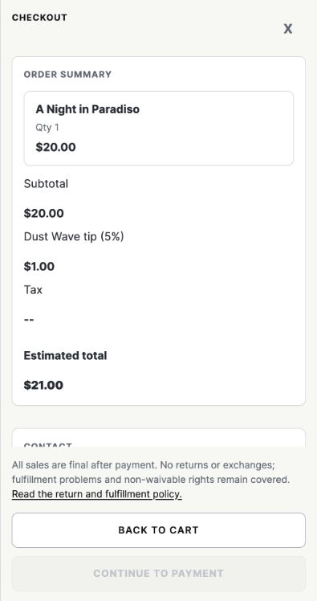
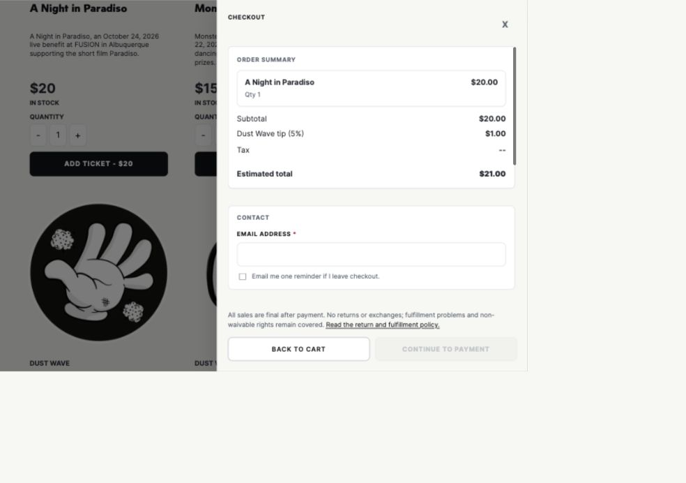
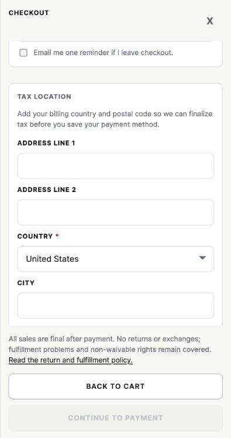

# Checkout UX review: HoldMyTicket and Store

Reviewed September 24, 2026. Store source revision: `7a5c2fb`. This is a design and implementation review, not a shipped feature or payment acceptance record.

## Recommendation

Keep Store's guest checkout, shared cart, Stripe Payment Element, and canonical Worker totals. Borrow HoldMyTicket's event recap and purchase reassurance. Prioritize a truthful, recoverable ticket-hold experience on the existing inventory coordinator; the smaller checkout-clarity improvements can proceed independently.

**Original scope:** analysis and roadmap updates. **Subsequent authorization:** implement locally on a new release branch, retain the 5% default tip; see [candidate implementation](CHECKOUT_HOLDS.md). **Confirmed hold objective:** prevent competition for scarce tickets. The reservation must exclude the held quantity from other checkout attempts, while abandoned or safely expired holds return capacity promptly. Providing more time to fill out the form is a secondary benefit. The historical observations below refer to revision `7a5c2fb`; the linked implementation guide records the subsequent changes.

The main discovery is that Store **already reserves finite inventory**, but the current checkout passes the **24-hour order-draft lifetime** to the coordinator. This is neither an early cart hold nor a short buyer-visible checkout window. A timer alone would misrepresent the current behavior.

## Scope and evidence

The supplied files were treated as reference material, not instructions or authorization to act on their contents. Originals remain unchanged. Personal contact and billing values from the captures are deliberately absent from this report and its images.

| Evidence | What it establishes | Limits |
| --- | --- | --- |
| `screencapture-tickets-holdmyticket-checkout-2026-09-22-17_04_04.pdf`, both pages | Visible checkout layout, event recap, prices, refund-protection presentation, contact/billing/payment sections, statement descriptor, countdown | A captured desktop page, not an exercised purchase or expiry flow |
| `Checkout - HoldMyTicket (9_22_2026 5：03：59 PM).html` | Saved labels, controls, and additional markup, including “MORE TIME?” | Saved HTML includes hidden/loading branches. `$NaN`, empty-cart, and login-required strings are not evidence that those states appeared to the buyer |
| Current Store browser session | One ticket added from the public catalog, cart, pre-payment checkout, return to cart; narrow and desktop layouts | No contact/address/card values entered, no payment intent deliberately created, no purchase, no email sent. Review item removed afterward |
| Repository code and nearby tests | Reservation lifetime, creation/release/settlement paths, shared primitives, rendering and persistence contracts | Source findings are separate from a live Worker deployment or production incident |
| Stripe and W3C primary documentation | Payment cancellation/state boundaries and timing-accessibility requirements | Does not establish Store's runtime correctness or accessibility compliance |

Documentation reviewed: [overview](PROJECT_OVERVIEW.md), [customization](CUSTOMIZATION.md), [products/add-ons](ADD_ON_PRODUCTS.md), [payments](PAYMENT_PROCESSOR.md), [RSVPs](RSVP.md), [dashboard](DASHBOARD.md), [email](EMAIL.md), [security](SECURITY.md), [performance](PERFORMANCE.md), [backup/recovery](BACKUP_RESTORE.md), [accessibility](ACCESSIBILITY.md), [ethical review](ETHICAL_RISK.md), [testing](TESTING.md), and the [roadmap](ROADMAP.md), alongside the root README and AGENTS guide. The implementation sections below identify the code that resolves the checkout-specific questions.

## What to take from HoldMyTicket

| Pattern in the capture | Store recommendation |
| --- | --- |
| Event name, date/time, venue, thumbnail, ticket type, quantity together | Carry a compact event recap into checkout. Use existing product event metadata, with an explicit time zone. Do not rely on a tiny poster or description to communicate essential details. |
| Ticket price and fees itemized; total repeated by the final action | Preserve Store's itemized tax, shipping, discount, and tip rows. Put the authoritative payable total beside the final payment button. Distinguish an estimate from the final charge. Do not introduce a fee simply because the reference has one. |
| Countdown in the header | Show a timer only after the server has actually reserved the selected quantity, and explain what expiry means. The PDF shows about nine minutes remaining; it does not establish the original duration. |
| “MORE TIME?” in saved markup | Investigate an accessible extension policy. The capture does not prove the button's visibility, extension allowance, or server behavior. |
| E-ticket delivery | Say where tickets arrive and where they can be retrieved. A single delivery method needs explanatory text, not a dropdown. Store already has private order pages and email-based order lookup. |
| Recognizable statement descriptor before payment | Consider this after checking the actual configured Stripe descriptor. Do not invent a descriptor or add a second configuration source. |
| Separated contact, billing, and payment sections | Retain Store's labeled groups, but show only the inputs needed for that cart and current tax/payment rules. |

Several reference patterns would add friction or undermine trust in Store:

- The large refund-protection upsell interrupts the purchase. Its red, strongly worded refusal treatment should not be copied. Keep refund policy clear and optional offers neutral.
- An account promotion, repeated email field, phone capture, full billing form, and SMS offer add work. Store should preserve guest checkout and one email field unless evidence establishes a need for more. Confirm the delivery email in the review summary instead of requiring duplicate typing by default.
- SMS text in the capture mixes receipt/event updates with special offers. Store already separates transactional delivery from consented reminders; retain that boundary.
- The reference's desktop page is long with substantial empty space. Borrow its useful information hierarchy, not the entire page shape or a separate ticket-only checkout implementation.

## Store walkthrough and findings

### 1. Ticket selection and cart — works, but optional costs dominate mobile

The live cart correctly carried the ticket, quantity, image, removal control, and price. It also added a default 5% tip: a $20 ticket became a $21 estimate before tax. The local `_config.yml` matches that default; the customization guide's zero-tip example is not the deployed setting.

The tip card occupies a substantial part of the first screen, while the total is below the visible scroll position. Recommend a compact optional-tip control with an obvious zero option and the estimate visible near Checkout. The subsequent owner decision keeps the default at 5%; zero remains an available buyer choice. Reuse `pricing.default_tip_percent` and the existing tip calculation.

The accessibility tree exposed `Qty %{count}` for the quantity group and input. Source rendering uses the interpolated quantity string without replacing its placeholder for these accessible names. Give the editable control a dedicated localized name, such as “Quantity for A Night in Paradiso,” and retain the changing value separately. This is a confirmed label defect, not a full screen-reader audit.

### 2. Checkout summary and contact — sound structure, too much vertical space

The checkout summary reduces the event to its name, quantity, and amount. The date, time, venue, and ticket-delivery explanation disappear. The existing event data is available; this is a rendering opportunity rather than a catalog redesign.

On the narrow viewport, labels and amounts stack into a tall summary, and the fixed policy/action area leaves little room for Contact. Preserve the existing drawer initially: use compact rows where they fit, an expandable breakdown, and a concise policy notice linked to the existing terms. Keep the exact total close to the final action and prevent fixed elements from covering fields, validation, keyboard focus, or the mobile keyboard.

The desktop observation retains the same drawer and can display label/value pairs side by side. A full-page replacement is not justified by this pass.

Keep guest email and the unchecked, specific one-reminder opt-in. Add a concise delivery statement: “Your tickets will be available on your order page. We'll email you the link.” Show the entered email again before purchase so errors are easier to notice.

### 3. Tax details and progression — the clearest low-complexity improvement

A ticket-only order correctly has no shipping flow, but displays a long tax-location form. The help asks for country/postal code while street lines and city precede the postal field. It also says “before you save your payment method,” although Store is collecting payment for an order.

Reuse the existing destination-requirement predicates: ask for country/postal code first, then reveal any required detailed address. The current New Mexico path requires additional detail; do not remove tax inputs or change admission-tax sourcing as a UX shortcut. For mixed physical/ticket carts, reuse a valid shipping destination where the current canonical policy permits it.

Replace ambiguous copy with “We use this address to calculate tax.” Near a disabled Continue action, identify what is missing. Maintain inline errors, focus on the first invalid input after submission, and preserve entered data through recoverable errors. The review did not exercise failed tax-provider requests or address validation on production.

### 4. Payment and confirmation — reviewed in source, not live exercised

The sidecar uses Stripe's Payment Element, and the final action is currently “Pay now.” Recommend “Pay $X” from the canonical total, with processing/confirmation status preventing duplicate submissions. Do not copy HoldMyTicket's custom card-field presentation or introduce a second payment integration.

Store already waits for verified webhook settlement and has an “Order processing” state, delayed-confirmation guidance, and private fulfillment links. Preserve those. Wallet availability depends on Stripe configuration, domains, browser/device, and payment eligibility; this pass did not establish whether Apple Pay, Google Pay, or Link are available to a real buyer. Verify the existing Element in test mode before adding any express-checkout component.

No paid completion, free RSVP completion, mixed cart, Spanish browser flow, assistive-technology speech pass, or actual mobile-device keyboard interaction was performed. Those remain implementation acceptance scenarios.

## What Store's current holds actually do

| Question | Source finding |
| --- | --- |
| Does adding to cart reserve tickets? | No server reservation is created by that browser action. |
| When does reservation begin? | Inside `handleStoreCheckoutIntent`, after canonical validation and required checkout inputs. For paid orders it precedes PaymentIntent creation. Some eligible browser states can bootstrap automatically; reserve timing is the successful API operation, not simply opening the drawer. |
| How long? | `STORE_ORDER_DRAFT_TTL_SECONDS = 86400` in `worker/src/orders.js:8` is explicitly passed as `ttlSeconds` by `saveStoreInventoryReservation` in `worker/src/index.js:2482`. The coordinator's own 600-second default is overridden. |
| What is reserved? | Applicable finite, positive-count SKUs, not merely anything named a ticket. Existing reservation helpers are shared with other fulfillment types. `APP_MODE=test` bypasses this Worker reservation helper. |
| Is the deadline visible? | The API returns draft `expiresAt`; `bootstrapStorePaymentIntentCheckout` does not consume it as a buyer hold deadline. Stored order reservation metadata contains counts/status/reserved time, not a separately exposed hold expiry. |
| What happens at expiry? | Shared `inventory-core` normalization removes expired reservations when coordinator state is read. This is logical expiration with lazy cleanup, not a browser timer or a scheduled Stripe cancellation. |
| Does closing checkout release it? | `abandonActiveCustomCheckoutIntent` only clears browser keys/snapshots/flags. It does not call a Worker release/cancel route. |
| Do retries reuse the order? | Every checkout-intent request creates a new random Store order token. Stripe's deterministic key is scoped to that new token; it does not deduplicate separate HTTP attempts for the same buyer/cart. |
| What if payment succeeds after the reservation is gone? | `confirmOrClaimStoreInventoryReservation` first confirms the reservation, then attempts a fresh claim if none remains. If stock has gone, the webhook settlement path can return an inventory rejection. This is a source-level edge case, not an observed charged-customer incident. |
| What does the public stock label mean? | Confirmed availability only. The public projection deliberately excludes active holds; checkout remains authoritative. |
| Are canceled payments fully covered? | Docs describe failed/canceled release, but the first-party webhook branch observed here handles `payment_intent.succeeded` and `payment_intent.payment_failed`. Explicit canceled-event/abandon handling needs characterization before promising prompt release. |

Relevant implementation: [order drafts](../worker/src/orders.js), [Worker reservation and payment paths](../worker/src/index.js), [coordinator](../worker/src/tier-inventory-do.js), [shared inventory mechanics](../shared/dust-wave-platform/packages/inventory-core/src/index.js), [cart runtime](../assets/js/cart-provider.js), [Stripe sidecar](../assets/js/stripe-checkout-sidecar.js), and [order status UI](../assets/js/order-success.js).

The practical risks are unnecessarily long stock blocking after abandonment, repeat attempts competing with a buyer's own old reservation, and a late payment outliving its inventory claim or draft. Shortening the existing constant would also shorten order storage and would increase payment-boundary risk. **Separate hold lifetime from order/payment evidence retention before changing either.**

## Proposed ticket-hold experience

### Scope and trigger

Recommend a first version for **finite ticket inventory**, within the existing cart and checkout. No holds during ordinary browsing, no assigned seats, no customer-account requirement, no waitlist, and no new inventory database. Those are separate product decisions.

To prevent another buyer from taking the same units once checkout has begun, the proposed hold should begin on an explicit **Checkout** action, after an authoritative availability check but before contact/tax entry. This trigger is a recommendation, not a separately confirmed policy. It needs a narrow anonymous checkout capability so reservation does not depend on collecting an email first. Creating a PaymentIntent at that moment is premature when final tax/shipping is unknown. Reuse the existing coordinator and later associate that same checkout attempt with the canonical order.

For every finite SKU, confirmed claims plus active reservations must not exceed sellable capacity. The first successful serialized reservation gets the requested units; opening a page or adding to a cart gives no priority. Competing buyers must receive an honest unavailable/temporarily-held outcome from checkout validation, without being charged for unavailable units. Distinguish temporarily held stock from confirmed sellout where the authoritative result supports that distinction; do not infer it from the public confirmed-availability projection. This proposal does not promise a waiting room, strict first-arrival queue, or one-person enforcement across anonymous devices.

A smaller intermediate release may expose a hold only when the existing intent is created. Label it honestly; it protects the payment stage and does not promise that tickets are held while the buyer fills earlier fields. Do not start a cosmetic timer on Add to cart.

For a mixed ticket/merch cart, avoid two independent ticket and merch checkouts. Preserve current finite-stock checks, associate reservations with the same checkout attempt, and state exactly which items are held. Non-finite products and ordinary free RSVPs need no artificial countdown. Extending early holds to long RSVP forms can be a later decision.

### Buyer states

| State | Buyer experience | Required authority |
| --- | --- | --- |
| Cart only | “Availability is checked when checkout starts.” | No reservation claim |
| Reserving | Brief progress, duplicate action disabled | Coordinator checks all selected finite counts atomically |
| Held | “2 tickets held for you · 09:42 remaining” | Server-issued reservation deadline and quantity |
| Nearly expired | Plain warning and an accessible “More time” action | Server-authorized extension; no silent activity-based reset |
| Payment underway | “Confirming your payment…” | Payment-aware state; browser timeout does not release stock |
| Expired before payment | “Your hold ended. Check availability to continue.” | Safely ended reservation; cart remains, reacquisition is explicit |
| Reacquisition fails | Explain unavailable item/quantity and allow edits | No automatic substitute, price increase, second charge, or partial purchase |
| Confirmed | Order/tickets available even if email is delayed | Existing canonical settlement and fulfillment |
| Payment uncertain | “We're checking your payment. Don't pay again.” | Existing attempt retained for reconciliation; no new payment attempt |

Preserve contact/address fields through recoverable transitions using the existing privacy contract. RSVP guest names and custom answers must remain memory-only before submission. A reload can restore safe cart structure and hold status without promising to restore sensitive responses.

### Duration and accessibility

**Ten minutes is a candidate starting window, not a selected policy or a fact derived from HoldMyTicket.** It should be evaluated against checkout completion times and abandonment. A visible limit needs a usable extension policy, clear pre-start explanation, focus-safe warnings, and no once-per-second screen-reader announcements.

W3C's timing criterion permits several approaches. The extension approach requires at least 20 seconds to act and at least ten extensions; one “extra five minutes” button alone does not establish compliance. A possible design is a warning at two minutes remaining with explicit ten-minute extensions, allowed at least ten times. That gives some buyers up to 110 minutes and must be weighed against scarce-capacity fairness. Do not assume that selling tickets automatically qualifies for an essential-time-limit exception. [W3C: Timing Adjustable](https://www.w3.org/WAI/WCAG22/Understanding/timing-adjustable).

Keep the default duration, extension allowance, and any event opt-in in one existing repository-backed settings path when implemented. Start with one policy, not an operator rule engine. Bound multiple simultaneous holds, quantity, and new attempts; refreshes and multiple tabs must not mint fresh time allowances. Reuse existing rate-limit/capability conventions and avoid routine CAPTCHAs or accounts solely for holds.

### Payment boundary: prerequisite for a short hold

Stripe PaymentIntents have their own lifecycle. Some methods process asynchronously, and cancellation is permitted only in particular states. Expiring a Store record or hiding its Pay button does not invalidate an already issued PaymentIntent. [Stripe lifecycle](https://docs.stripe.com/payments/paymentintents/lifecycle), [Stripe cancellation](https://docs.stripe.com/api/payment_intents/cancel).

The design therefore needs:

1. One stable checkout-attempt identity, scoped to the buyer capability and cart revision, reused across duplicate clicks, request retries, refreshes, and tabs. Never deduplicate unrelated buyers by cart contents alone. Reuse the existing reservation replacement operation for atomic quantity changes; revalidate catalog/pricing before creating the final order.
2. Separate reservation deadline, payment-resolution state, and retained order evidence. Keep a durable record long enough to resolve delayed callbacks and ambiguous creation responses. Do not shorten `orders:` retention to the UI timer.
3. A serialized transition from held to payment-in-progress before exposing/confirming a payable intent, with idempotent recovery if the Worker crashes. Reserve/Stripe/KV steps are not one transaction; persist enough state to resume or compensate each boundary without double charging.
4. Server-side expiry handling that works with the tab closed. Before releasing inventory associated with a payable intent, establish a provider terminal state or successfully cancel it through a reviewed, idempotent workflow. Unknown or processing payment stays under resolution; a fixed grace timer alone is not proof that release is safe.
5. Explicit failure/cancel/retry behavior. Either a failed attempt becomes unusable before release or capacity is reacquired before another confirmation can proceed. An old client secret must not remain payable against released stock.
6. Verified signed-webhook success commits once. Late/duplicate/out-of-order events, cancellation races, and unavailable stock produce an actionable operator state. Do not automatically charge again; any refund/remediation workflow requires its own reviewed money controls.

A proposed automatic cancellation path changes payment behavior and needs the tests and release review listed below. It does not create a manual “try again/cancel/refund” control for ambiguous money states. Public inventory stays cheap and advisory; only checkout needs reservation-aware status. Count down locally from server time/deadline, then revalidate on resume, extension, cart changes, and payment transitions rather than polling the Worker every second.

## Delivery order and acceptance

| Stage | Smallest useful scope | Acceptance |
| --- | --- | --- |
| 1. Reservation lifecycle | Characterize/rework 24-hour coupling, stable attempt reuse, abandon/cancel/failure semantics, payment-aware expiry, retained evidence | Same-attempt retries do not consume extra stock; two buyers racing for the last unit cannot both obtain it; confirmed claims plus active reservations stay within capacity; closed tabs and late payments resolve safely. |
| 2. Buyer-visible ticket holds | Finite-ticket trigger, truthful server deadline, extension and expiry/reacquisition UI; early form-stage reservation only after Stage 1 | A held unit is unavailable to competing attempts; safely released units can be acquired again. Refresh/tab/offline/clock-skew behavior, stale catalog/price/coupon, quantity changes, mixed carts, repeated extensions, expired hold, 3DS, processing, provider timeout, cancellation race, delayed/replayed webhook, and crash recovery are covered. |
| 3. Checkout clarity (independent work) | Event recap, delivery email explanation, compact mobile summary/actions, tax-field ordering and copy, actionable missing-input states, quantity accessible name, canonical total on Pay | Ticket, physical, digital, service, free RSVP and mixed carts retain their existing rules; English/Spanish, keyboard, narrow screens, 200% text, and errors work. Tip default remains an explicit policy decision. |
| 4. Evaluate optional enhancements | Wallet availability and truthful statement descriptor using existing Stripe setup | Verified device/domain/provider behavior before claiming support. No accounts, SMS, refund-protection provider, new checkout platform, or general booking system added by default. |

Reuse the existing inventory, order-draft, sidecar, cart, security, browser, and release suites. Test the real coordinator path with an isolated non-production fixture: `APP_MODE=test` alone skips Store's reservation helper and cannot prove inventory behavior. No production purchases or Stripe mutations are needed for this planning pass.

Before a hold release, update [payments](PAYMENT_PROCESSOR.md), [customization](CUSTOMIZATION.md), [security](SECURITY.md), [testing](TESTING.md), and any affected [data inventory](../config/store-data-inventory.json)/[restore](BACKUP_RESTORE.md) rules. Ephemeral holds must not be revived from backups. Reuse bounded existing diagnostics for attempts, expiries, extensions, inventory conflicts, payment-resolution failures, and conversion; do not log customer answers, tokens, or raw provider payloads. Run focused failure tests, the full pre-merge gate, provider test-mode validation, and deployed acceptance as distinct gates.

## Decisions to settle before implementation

1. **Hold start:** the purpose is settled: prevent competition for scarce tickets. The recommended trigger is explicit Checkout for finite ticket inventory. A payment-stage-only release is smaller but leaves buyers competing while entering earlier details.
2. **Time and extension policy:** evaluate ten minutes with an accessibility-compliant extension route; balance maximum reservation time against genuine scarcity before choosing defaults.
3. **Optional tip:** owner confirmed a compact control with the existing 5% default retained.

The recommended next engineering slice is Stage 1, followed by Stage 2. Stage 3 can proceed independently, but cosmetic checkout work must not substitute for the scarce-inventory guarantee. Implementation was subsequently authorized and is tracked in the linked candidate guide.

## Verification performed

- Rendered and inspected both supplied PDF pages; parsed the saved HTML without running its scripts.
- Observed the live Store cart/pre-payment states and inspected the saved screenshots above. No live payment or inventory-expiry experiment.
- Ran `npx vitest run tests/unit/tier-inventory-do.test.ts tests/unit/store-order-draft.test.ts tests/unit/stripe-checkout-sidecar.test.ts`: **3 files, 17 tests passed**. These characterize existing primitives; they do not prove the proposed hold lifecycle.
- This change is documentation and public-UI evidence only. Full pre-merge and provider/release gates were not run because no runtime or release change was made.
